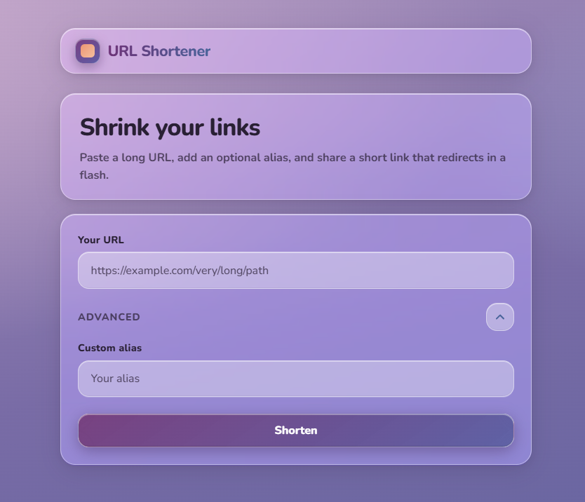

# URL Shortener

**Portfolio demo** — Hands-on showcase of designing a scalable and distributed URL shortener: patterns typical of high-load systems (cache-aside reads, CQRS, async analytics via messaging, serverless workers, OpenTelemetry, infrastructure-as-code). The goal is to demonstrate end-to-end experience with cloud-native, horizontally scalable architecture.

**What it does:** Built with .NET 10 and Vue 3. Shorten long URLs, redirect with sub-100ms latency targets, and track clicks with optional expiration and cleanup.

---



---

## Features

- **Shorten URLs** — Submit a long URL; get a unique short code (up to 7 characters, Base62). Optional custom alias and idempotent creation (same URL + alias returns existing short link).
- **Fast redirects** — Redis cache-aside for reads; on miss the API loads from Cosmos DB without writing Redis on redirect (read-through). Expired or missing links return 404.
- **Expiration & cleanup** — Optional per-link expiration date; links not accessed for one month can be removed (Cosmos DB TTL plus scheduled cleanup via Azure Functions timer trigger).
- **Analytics** — Click count and last-accessed timestamp: the API publishes click events to **Azure Service Bus**; an Azure Function consumes messages and patches Cosmos DB so redirects stay fast and scalable.
- **Abuse protection** — Rate limiting and throttling per IP; RFC 7807 ProblemDetails for consistent error responses.

---

## Tech Stack

| Layer         | Technology                                              |
| ------------- | ------------------------------------------------------- |
| Backend       | .NET 10, C# 14, Minimal API, CQRS with MediatR          |
| Frontend      | Vue 3, TypeScript, Vite                                 |
| Database      | Azure Cosmos DB (NoSQL)                                 |
| Cache         | Redis                                                   |
| Messaging     | Azure Service Bus (queues)                              |
| Orchestration | .NET Aspire                                             |
| Deployment    | Docker Compose, Azure Bicep                             |

---

## Quick Start

### Prerequisites

- [.NET 10 SDK](https://dotnet.microsoft.com/download)
- [Docker Desktop](https://www.docker.com/products/docker-desktop/) (for Redis and Cosmos DB emulators or containers)

### Run locally with Aspire

From the repository root:

```bash
dotnet run --project src/Shortener.AppHost
```

Aspire starts the API, Redis, Cosmos DB emulator, **Azure Service Bus emulator**, Azure Storage emulator (Azurite), and the Azure Functions host (`Shortener.Host.Functions`) for cleanup and **click analytics consumption**. Open the Aspire dashboard URL shown in the console to inspect services and logs.

The cleanup function schedule is configured in `src/Shortener.Host.Functions/local.settings.json` using `CleanupSchedule` (development default: once per minute). When you run the Functions project **without** Aspire, set `ConnectionStrings:messaging` to your Service Bus connection string (the host maps `ConnectionStrings__messaging` to the binding name `messaging` used by the Service Bus trigger).

### Run with Docker Compose

Run the entire solution in containers (API, frontend, Redis, Cosmos DB emulator, Azure Service Bus emulator):

```bash
docker compose up --build
```

- **Frontend:** http://localhost:3000
- **API:** http://localhost:8080 (Swagger at `/swagger` in Development)
- **Cosmos DB Data Explorer:** http://localhost:1234 (when Cosmos emulator is running)

Short links resolve via the frontend origin (e.g. `http://localhost:3000/{shortCode}`). The nginx proxy forwards `/api` and short-code redirects to the API.

### Environment variables

Connection strings and keys (Cosmos DB, Redis, **Service Bus**) are configured via Aspire or environment variables. For local development, use [user secrets](https://learn.microsoft.com/en-us/aspnet/core/security/app-secrets) or a `.env` file (see `.env.example` if present). Do not commit secrets.

---

## Project Structure

```text
src/
├── Shortener.AppHost/              # Aspire host (API, Redis, Cosmos, Service Bus emulator, Functions)
├── Shortener.Host.Api/             # Minimal API (redirect, create, analytics)
├── Shortener.Host.Functions/       # Azure Functions: cleanup timer + Service Bus click consumer
├── Shortener.ServiceDefaults/      # Shared Aspire, OpenTelemetry, resilience
├── Shortener.Domain/               # Domain models and logic
├── Shortener.Application/          # CQRS handlers (MediatR), vertical slices
├── Shortener.Application.Abstractions/  # Application contracts and interfaces
├── Shortener.Infrastructure.Abstractions/  # Persistence/cache abstractions
├── Shortener.Infrastructure.Shared/       # Shared infrastructure utilities
├── Shortener.Infrastructure.Database/     # Cosmos DB implementation
└── Shortener.Infrastructure.ServiceBus/   # Click analytics publisher (Service Bus)
tests/
└── Shortener.Domain.Tests/         # Domain unit tests
docs/                               # Architecture, features, ADRs, tasks
```

---

## Documentation

| Topic                                                       | Document                                                                                    |
| ----------------------------------------------------------- | ------------------------------------------------------------------------                    |
| Solution overview, NFRs, testing                            | [docs/solution.md](docs/solution.md)                                                        |
| Architecture, components, deployment                        | [docs/architecture.md](docs/architecture.md)                                                |
| Features (shortening, redirect, analytics, security)        | [docs/features/index.md](docs/features/index.md)                                            |
| Architecture decision records                               | [docs/decisions.md](docs/decisions.md)                                                      |
| Task list and definition of done                            | [docs/tasks.md](docs/tasks.md) · [docs/definition-of-done.md](docs/definition-of-done.md)   |

Task 4 (`docs/tasks.md` - Expiration & Cleanup) is implemented using the `Shortener.Host.Functions` timer-trigger host for scheduled cleanup execution.

---

## Code Conventions

- **Formatting & style** — All code follows the root [.editorconfig](.editorconfig) (naming, indentation, C# rules).
- **Package versions** — Central Package Management ([Directory.Packages.props](Directory.Packages.props)); projects reference packages without a `Version` attribute.

---
